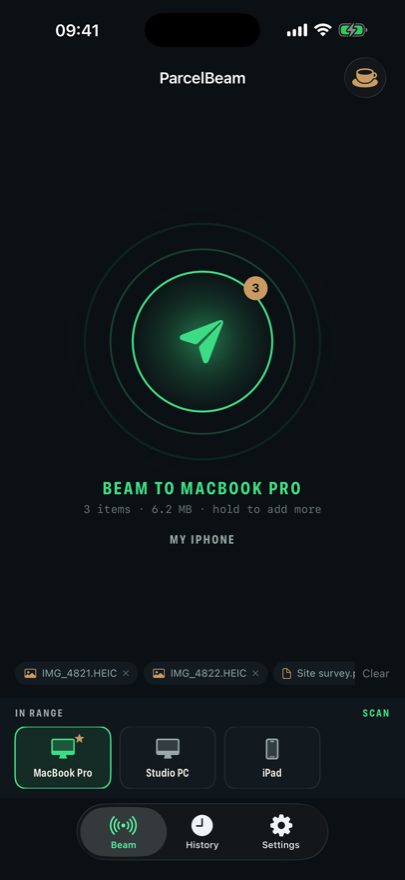
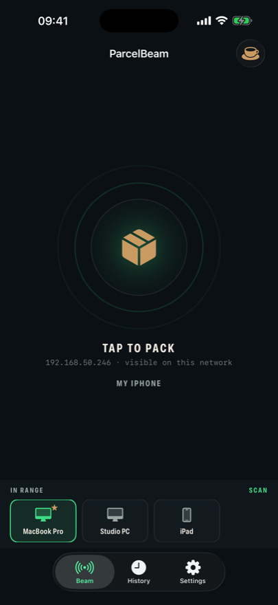
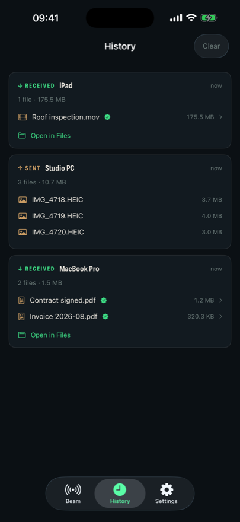
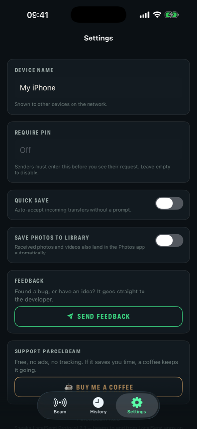

# 📦 ParcelBeam

**Beam files across your own network** — between **macOS, Windows, Linux,
Android and iPhone**, in every direction. No cloud, no accounts, no size
limits, no tracking: files travel directly between your devices and never
leave your network.

| From ⟶ To | macOS | Windows | Linux | Android | iPhone |
|---|:--:|:--:|:--:|:--:|:--:|
| **macOS** | ✓ | ✓ | ✓ | ✓ | ✓ |
| **Windows** | ✓ | ✓ | ✓ | ✓ | ✓ |
| **Linux** | ✓ | ✓ | ✓ | ✓ | ✓ |
| **Android** | ✓ | ✓ | ✓ | ✓ | ✓ |
| **iPhone** | ✓ | ✓ | ✓ | ✓ | ✓ |

Desktop platforms run the ParcelBeam app; phones run ParcelBeam for iPhone.
Both speak the same open local-network protocol, so they find each other on
your Wi-Fi.

### [⬇ Download for macOS, Windows or Linux](https://zoco94.github.io/parcelbeam-releases/)

*(or grab an installer straight from [Releases](https://github.com/zoco94/parcelbeam-releases/releases/latest))*

---

## ParcelBeam for iPhone

[On the App Store](https://apps.apple.com/us/app/parcelbeam/id6797666367) as 1.0 (20).
The iPhone app is built for the same network as the desktop:

- **Send from anywhere** — "ParcelBeam" in the iOS share sheet, straight from
  Photos, Files or Safari.
- **Receives too**, not just sends, with an accept prompt and optional PIN.
- **Verified transfers** — checksums are checked on the phone as well.
- **A real history** — tap any received file to preview it, save photos to your
  library, or jump to it in the Files app.
- **Favourite your devices** so your Mac is preselected the moment it appears.
- Same dark dispatch-terminal design as the desktop app.

  
  
  
  

[Get ParcelBeam for iPhone](https://apps.apple.com/us/app/parcelbeam/id6797666367)

## What it does

| | |
|---|---|
| **Send anything** | Files and whole folders, at full local-network speed. No 2 GB email limits, no upload wait. |
| **Share via link** | Serve your files to *any* browser on the network — scan a QR code with a phone that has no app at all. |
| **Verified transfers** | Every file carries a SHA-256 checksum that is verified on arrival. A corrupted transfer is rejected, never silently saved. |
| **PIN protection** | Require a PIN before anyone can send to you, with lockout after repeated wrong attempts. |
| **Encrypted** | HTTPS transfers with certificate pinning against each device's announced identity. |
| **Right-click sharing** | "Share with ParcelBeam" in Windows Explorer, macOS Finder Quick Actions, and GNOME/KDE file managers. |
| **Lives in the tray** | Receives while you work, with a notification when a parcel lands. |
| **Preserves timestamps** | Received files keep their original modification dates, like a real copy. |
| **No telemetry** | Zero analytics, zero tracking. See the [privacy policy](https://zoco94.github.io/parcelbeam-releases/privacy.html). |

## Install

| Platform | |
|---|---|
| **macOS** | Open the `.dmg` and drag ParcelBeam to Applications. Signed and notarized by Apple — it opens on first try, no warnings. |
| **Windows** | Run `ParcelBeam Setup.exe`, or use the portable `.zip`. The installer adds right-click sharing and firewall rules. Windows SmartScreen may warn on first run — the app is not yet code-signed on Windows. |
| **Linux** | `.AppImage` (make it executable and run) or `.deb`. |

**First launch on macOS:** grant Local Network permission when asked. Without it
the app runs but discovers nothing, which looks exactly like a bug.

## How it works

Devices announce themselves on the local network (UDP multicast on port 53317,
with a subnet scan as a fallback). Transfers run over HTTPS directly between the
two devices — there is no server in the middle, and nothing to sign up for. If
the two devices cannot see each other on the same network, no transfer happens.

## Support

- 🐞 Found a bug or have an idea? Use **Settings → Send feedback** inside the app.
- ☕ ParcelBeam is free. If it saves you time, [buy me a coffee](https://buymeacoffee.com/parcelbeam).

---

This repository hosts the **downloads and the website**. ParcelBeam's source is
not public; the app is licensed, not open source — see the licence included with
the application.

© 2026 Adrian Nicolaysen
